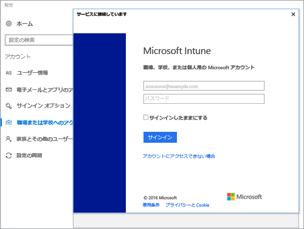
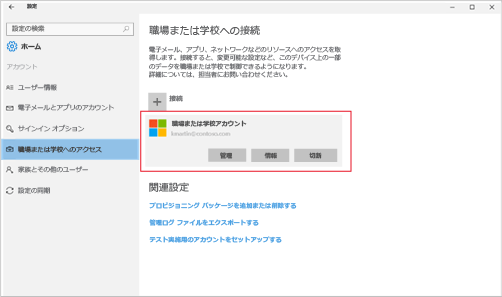

# Windows 10 デバイスを Intune ポータル サイト登録します。

Intune ポータル サイトを使用して、組織の管理対象 Windows 10 デバイスを登録します。 この記事では、Windows 10 バージョン 1607 以降と Windows 10 バージョン 1511 以前使用してデバイスを登録する方法について説明します。 開始する前に、以下のことを確認[デバイス上のバージョンを確認します。](windows-enrollment-company-portal.md#find-windows-10-version-number)正しい手順を利用できるようにします。  

Windows 10 デスクトップ、電話、タブレットなどさまざまなデバイスの種類がサポートされます。 登録の手順は、どのデバイスを使用しているのと同じです。 ただし、画面は、この記事に示すように、イメージからは少し異なる外観可能性があります。  

> [!VIDEO https://channel9.msdn.com/Series/IntuneEnrollment/Windows-Enrollment/player]  

## Windows 10 バージョン 1607 と以降のデバイスを登録します。 
次の手順では、Windows 10 バージョン 1607 以降で実行されているデバイスを登録する方法について説明します。  

1. **[スタート]** メニューに移動します。 Windows 10 Mobile デバイスの場合は、引き続き、**すべてのアプリ**一覧。

2. **[設定]** アプリを開きます。 アプリをアプリの一覧ですぐに使用できない場合は、種類「を設定します」と検索バーに移動します。

3. **[アカウント]** > **[職場または学校にアクセスする]** > **[接続]** の順に選択します。  

    ![[職場または学校にアクセスする] アカウントの選択](./media/w10-enroll-rs1-connect-to-work-or-school.png)  

4. 職場または学校の電子メール アドレスを入力し、**[次へ]** を選択します。  

     

5. 職場または学校のアカウントで Intune にサインインします。  

      

    最終的に、会社または学校がデバイスを登録しているというメッセージが表示されます。

6. 場合は、組織では、Windows こんにちはの PIN を設定する必要があります、確認コードを入力を求め。 コードを入力し、続け、PIN を作成する画面の指示します。  

7. **[準備が完了しました]** 画面で、 **[完了]** を選択します。 これでデバイスが登録されました。  

8. 接続を再確認するに戻り**設定** > **アカウント** > **アクセス職場または学校**します。  自分のアカウントが表示されます。  

      

それでも職場または学校の電子メール、ファイルなどのデータにアクセスできない場合は、 学習方法[アカウントに関する問題のトラブルシューティングを行う](troubleshoot-your-windows-10-device-windows.md#troubleshooting-steps-to-follow-if-you-see-access-work-or-school)します。  

## Windows 10 バージョン 1511 と以前のデバイスを登録します。  
次の手順では、Windows 10 バージョン 1511 以降で実行されているデバイスを登録する方法について説明します。  

1. **[スタート]** メニューに移動します。 Windows 10 Mobile デバイスの場合は、引き続き、**すべてのアプリ**一覧。

2. **[設定]** アプリを開きます。 アプリをアプリの一覧ですぐに使用できない場合は、種類「を設定します」と検索バーに移動します。

3. 選択**アカウント** > **アカウント**します。  

    ![[お使いのアカウント] を選択する](./media/W10-enroll-2-accounts-your-account.png)  

5. **[職場または学校アカウントを追加]** を選択します。  

    ![[職場または学校アカウントを追加] を選択する](./media/w10-enroll-3-add-work-school-acct.png)  

6. 職場または学校の資格情報でサインインします。  

      

それでも職場または学校の電子メール、ファイルなどのデータにアクセスできない場合は、 学習方法[アカウントに関する問題のトラブルシューティングを行う](troubleshoot-your-windows-10-device-windows.md#troubleshooting-steps-to-follow-if-you-see-your-account)します。   

## 次の手順  

ヘルプを取得するには、会社のサポートにお問い合わせください。 組織が見つかります IT について、[ポータル サイト web サイト](https://go.microsoft.com/fwlink/?linkid=2010980)します。 職場または学校のアカウントでサイトにサインインします。  

 

