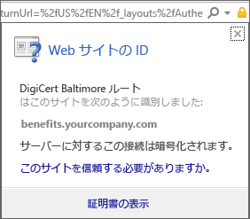
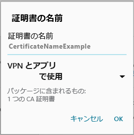

# 組織が必要としない証明書をインストールする  

デバイスが Intune に登録されておらず、必要な証明書がない場合は、ポータルサイトアプリにサインインすることはできません。 サインインしようとすると、次のメッセージが表示されます。

必要な証明書をダウンロードしてデバイスを登録するには、2つのオプションがあります。 

- ポータルサイトアプリでブラウザーアクセスを有効にします。
- 会社または学校の PC で、不足している証明書を特定します。 次に、インターネットを検索して、不足している証明書をダウンロードします。 

まず、ブラウザーアクセスを有効にするための手順を実行します。 その後、デバイスを登録できない場合は、手順に従って、インターネット上で証明書を検索します。 

## ブラウザーアクセスを有効にする
ブラウザーアクセスを有効にするには、次の手順を実行します。 アクセスを有効にすると、ポータルサイトによって適切な証明書がインストールされ、登録が続行されます。    

1. ポータルサイトアプリで、右上隅に戻り、メニューを選択します。  
2. **[設定]** を選択します。  
3. **[ブラウザーアクセスを有効]** にする で **[有効]** を選択します。  
4. デバイス管理者 画面で、**アクティブ化** を選択します。 

## Web 検索を使用して見つからない証明書を特定してダウンロードする
デバイスで証明書を手動で識別してインストールするには、次の手順を実行します。  

1. PC で、Internet Explorer を開きます。 この目的に使用する PC をお持ちでない場合は、会社のサポートに問い合わせてください。 会社のサポートの連絡先情報については、[ポータル Web サイト](https://go.microsoft.com/fwlink/?linkid=2010980)をご確認ください。

2. [ポータル サイト Web サイト](https://go.microsoft.com/fwlink/?linkid=2010980)に移動して、職場や学校の資格情報を使用してサインインします。

3. ブラウザーのアドレス バーの右端で、下のスクリーンショットのような、南京錠のような記号をクリックします。

    

    南京錠の記号が表示されない場合は作業を停止し、会社のサポートに問い合わせてください。 このロックは、安全にサインインされていることを意味するため、その記号が表示されるまで作業を続行しないでください。

4. **[View certificates]** (証明書の表示) を選択します。

    

5. **[証明のパス]** タブを選択し、インターネットから取得する必要がある証明書を特定します。 必要な証明書の名前は、上記の例のスクリーン ショットで強調表示されている場所と同じ位置にあります。

6. Bing や Google のような検索エンジンを使用して、前のセクションで特定した、欠落している証明書の名前を検索します。 証明書の「拡張子」は、それぞれ ".crt" または ".pem" などのように異なる可能性があります。

7. ルート証明書を Web サイトからダウンロードします。

8. 証明書をダウンロードした後、デバイスの上部から下にドラッグして通知を開き、通知の一覧にある証明書の名前をタップします。

4. 次のスクリーンショットのような **[Name the Certificate]** (証明書の名前指定) ダイアログ ボックスで、既定の証明書名を受け入れます。

5. **[認証情報の使用]** が **[VPN とアプリ]** に設定されていることを確認し、 **[OK]** をタップします。

    

6. 会社のポータル アプリを閉じます。

7. 会社のポータル アプリをもう一度開きます。 これで、会社のポータル アプリにサインインできるようになりました。 サポートが必要な場合は、会社のサポートに問い合わせてください。

上のような "証明書が見つかりません" というメッセージが表示されたが、この手順を既に実行している場合、別の証明書が存在する可能性があります。会社のサポートにそのインストールを依頼する必要があります。 サポートを得る場合は、[ポータル Web サイト](https://go.microsoft.com/fwlink/?linkid=2010980)で入手できる連絡先情報を使用して、会社のサポートに問い合わせてください。

## 次の手順  

サポートが必要な場合は、 社内サポートに問い合わせてください。 連絡先情報については、[ポータル サイト Web サイト](https://go.microsoft.com/fwlink/?linkid=2010980)をご確認ください。  
